# 新規プロダクト開発ドキュメント

**はじめに**

**このドキュメントは、新規プロダクト開発において最も重要な「顧客の真の課題を解決し、かつ持続可能なビジネスとして成功する」という目標を達成するための包括的なガイドです。アイデア創出から、PRD、各仕様書の作成、リリース、運用、そして将来の成長まで、プロダクト開発の全ライフサイクルをカバーしています。**

## 1. プロジェクト基本情報

### 1.1 背景・目的

#### 市場の現状と課題:
* [市場規模、成長率、トレンドなどを具体的に記述。データソース（調査レポート、統計データなど）を明記。]
* [競合製品・サービスをリストアップし、それぞれの強み・弱みを分析。]
* **[ポジショニングマップ（例：価格 vs 品質）を作成し、各競合の立ち位置を視覚的に示す。]**
* [既存の市場や競合製品では満たされていないニーズや課題を明確に記述。]
* 記入例：「〇〇市場は、20XX年には〇〇億円規模に達すると予測されており（出典：〇〇調査レポート）、年平均成長率は〇〇％と高い成長が見込まれています。しかし、既存の〇〇製品は、△△という点でユーザーのニーズを十分に満たせていません。」

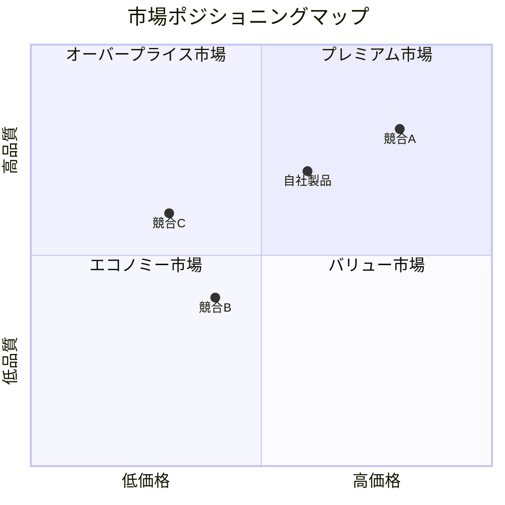

#### ユーザーのニーズ:
* [ターゲットユーザーを具体的に定義（年齢層、性別、職業、ライフスタイル、ITリテラシーなど）。]
* [ペルソナを設定する場合は、詳細なプロフィール、行動パターン、価値観、抱えている課題などを記述。]
* [ユーザーインタビュー、アンケート、行動観察などの調査結果を要約し、主要な課題やニーズを抽出。]
* **[ユーザーインタビューの質問例、アンケートの項目例など、具体的な調査方法の例示を追加。]**
* 記入例：「ターゲットユーザーは、30代〜40代の共働き夫婦で、〇〇に関心が高く、△△という課題を抱えています。ペルソナ「〇〇さん」は、…（詳細なプロフィール）…という状況で、…（具体的な課題）…に困っています。」

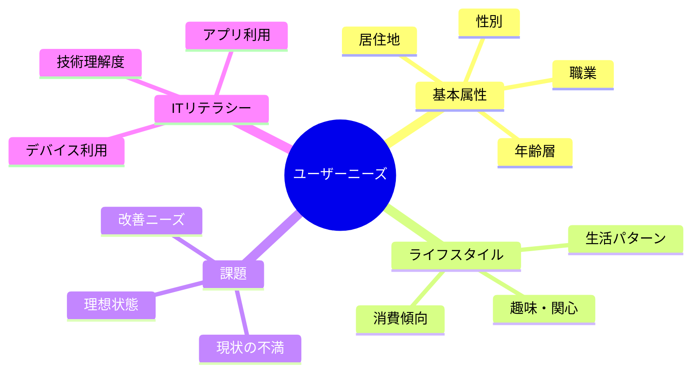

#### プロダクトの目的:
* [このプロダクトが解決する課題、提供する価値、達成したい目標（KPI、OKR）を具体的に記述。]
* [長期的なビジョン（例：〇〇市場でNo.1になる、〇〇業界のスタンダードになる）を記述。]
* 記入例：「このプロダクトは、〇〇という課題を解決し、△△という価値を提供することで、ユーザーの□□を改善します。KPIとして、〇〇を〇〇ヶ月以内に〇〇％向上させることを目指します。将来的には、〇〇市場でNo.1のシェアを獲得し、〇〇業界のデファクトスタンダードとなることを目指します。」


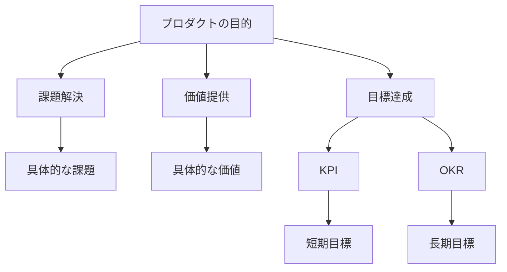

**(この章では、プロダクト開発の背景と目的を明確にし、市場の課題、ユーザーのニーズ、そしてプロダクトが目指す方向性を定義します。これは、顧客の課題解決とビジネスの成功の両立という最も重要な目標を達成するための基盤となります。)**

### 1.2 チーム体制 / ロール定義
* [プロダクトオーナー、プロジェクトマネージャー、デザイナー、エンジニア（フロントエンド、バックエンド、インフラ）、QA、マーケティング、法務、セキュリティなど、各メンバーの役割と責任範囲を明確に記述。]
* [各メンバーの連絡先（メールアドレス、Slackチャンネルなど）を記載。]
* [外部パートナーや協力会社がいる場合は、同様に役割と連絡先を記載。]
* 記入例：「プロダクトオーナー：〇〇（氏名）、役割：プロダクトのビジョンと戦略を策定し、…（具体的な責任範囲）…。連絡先：〇〇@example.com」

```mermaid
graph TB
    A[CEO] --> B[PM]
    B --> C[Dev]
    B --> D[Des]
    B --> E[QA]
    B --> F[Mkt]
    B --> G[Legal]
    B --> H[Sec]

    subgraph チーム体制図
    [CEO: プロダクトオーナー]
    [PM: プロジェクトマネージャー]
    [Dev: 開発チーム]
    [Des: デザインチーム]
    [QA: 品質保証チーム]
    [Mkt: マーケティングチーム]
    [Legal: 法務チーム]
    [Sec: セキュリティチーム]
    end
```

### 1.3 コミュニケーションルール

#### 使用ツール:
* [プロジェクト管理ツール（JIRA、Asanaなど）、コミュニケーションツール（Slack、Teamsなど）、ドキュメント管理ツール（Confluence、Notionなど）、デザインツール（Figma、Adobe XDなど）を具体的に記載。]
* [各ツールの利用目的、利用ルール（チャンネルの使い分け、通知設定など）を明確に記述。]

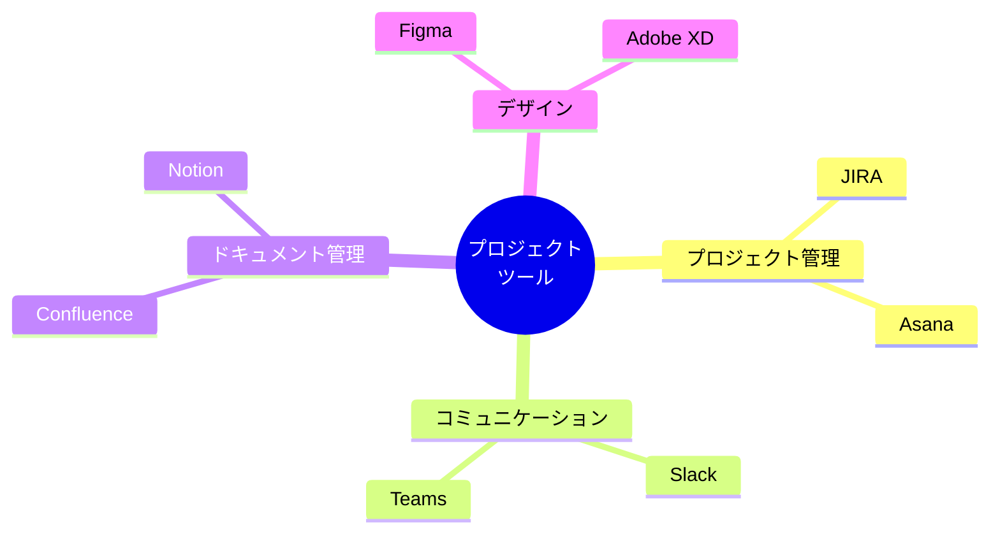

#### 定例会議:
* [定例会議の種類（例：デイリースクラム、スプリントレビュー、スプリントプランニング）、開催頻度、参加者、目的、アジェンダを記述。]
* [会議の議事録の作成・共有方法を記載。]

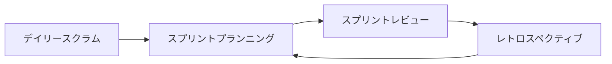

#### レビュー・承認フロー:
* [各ドキュメントや成果物（PRD、仕様書、デザイン、コードなど）のレビュー担当者、承認者、レビュー・承認のタイミング（例：各開発フェーズの完了時、スプリントの終了時）を明確に記述。]
* [レビュー・承認に使用するツール（例：JIRAのチケット、Confluenceのコメント機能）を記載。]
* [承認後の変更管理プロセス（変更リクエストの起票方法、承認フロー、ドキュメントの更新方法など）を記述。]


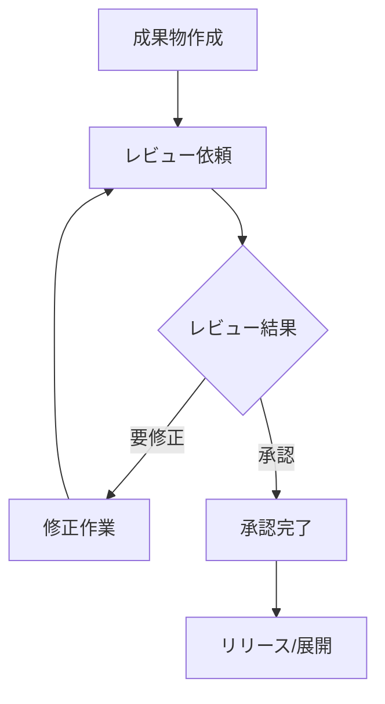

## 2. アイデア創出・企画フェーズ（ユーザー課題・ビジネスモデル）

### 2.1 ユーザー課題 / JTBD
**(この章では、顧客の課題を深く理解し、プロダクトが解決すべき真のニーズを特定します。これは、顧客の課題解決とビジネスの成功の両立という最も重要な目標を達成するための第一歩です。)**

* [ユーザーインタビュー、アンケート、行動観察などの調査結果を詳細に記述。]
* [ペルソナを設定している場合は、各ペルソナの課題、ニーズ、ジョブステートメントを記述。]
    * **ジョブステートメントの例:** 「[状況]の時、[ユーザー]は[動機/目的]のために、[期待する結果]を達成したい（が、[阻害要因]によって妨げられている）。」
* [課題の優先順位付け（例：緊急度、重要度、影響度などを考慮）。]
* 記入例：
    * 「ユーザーインタビューの結果、〇〇という課題が最も多く挙げられました（回答者の〇〇％）。」
    * 「ペルソナ「〇〇さん」のジョブステートメント：〇〇の時、〇〇さんは〇〇のために、〇〇を達成したい（が、〇〇によって妨げられている）。」

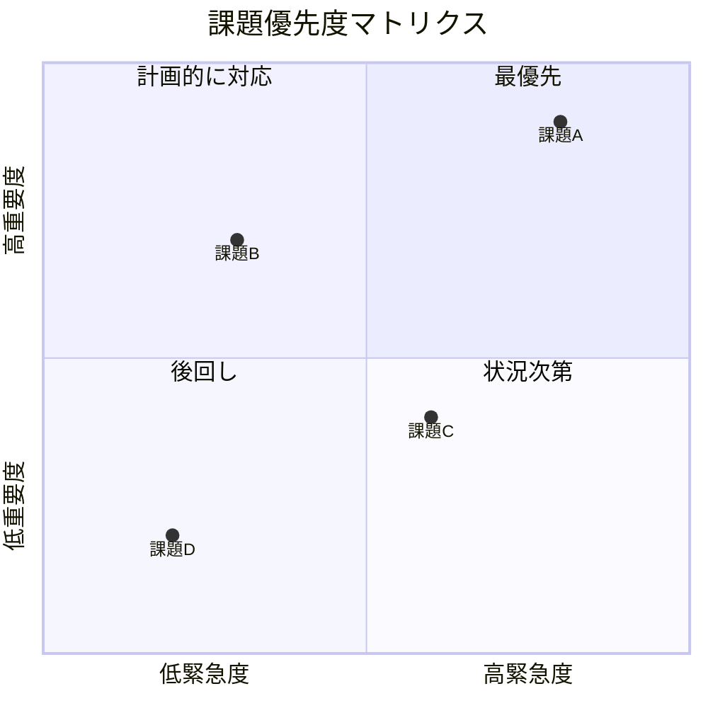

### 2.2 ビジネスモデル / マーケティング施策
**(この章では、プロダクトがどのように収益を生み出し、持続可能なビジネスとして成長していくかを検討します。顧客の課題解決とビジネスの成功の両立という最も重要な目標を達成するためには、優れたビジネスモデルが不可欠です。)**

#### ビジネスモデルキャンバス (BMC):
* [9つの要素（顧客セグメント、価値提案、チャネル、顧客との関係、収益の流れ、リソース、主要活動、パートナー、コスト構造）を具体的に記述。]
* [各要素間の関係性を明確にし、ビジネスモデル全体の整合性を確認。]

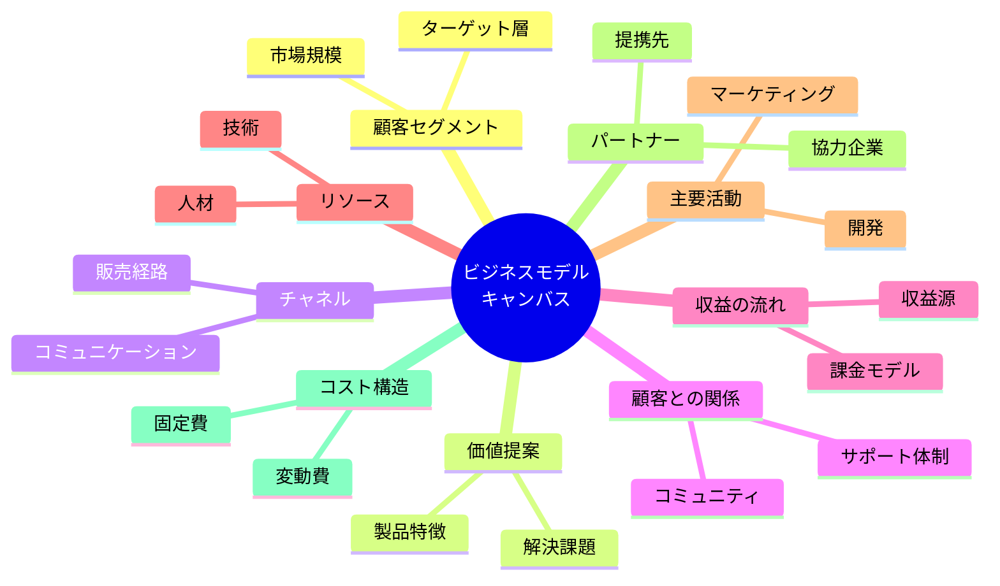


#### マーケティング施策:
* [ターゲットユーザーにリーチするための具体的なマーケティング施策（例：SNS広告、コンテンツマーケティング、SEO、イベント開催）をリストアップ。]
* [各施策の目的、KPI、予算、スケジュール、担当者を記述。]

##### マーケティング施策の要件化:
* [各施策に必要な機能要件（例：SNS連携機能、広告配信機能、イベント管理機能）を詳細に記述。]
* [非機能要件（例：パフォーマンス、セキュリティ、スケーラビリティ）も考慮。]
* **[各施策のKPIと、それを計測するためのツール（例：Google Analytics、Mixpanel）の連携方法を具体的に記述。]**

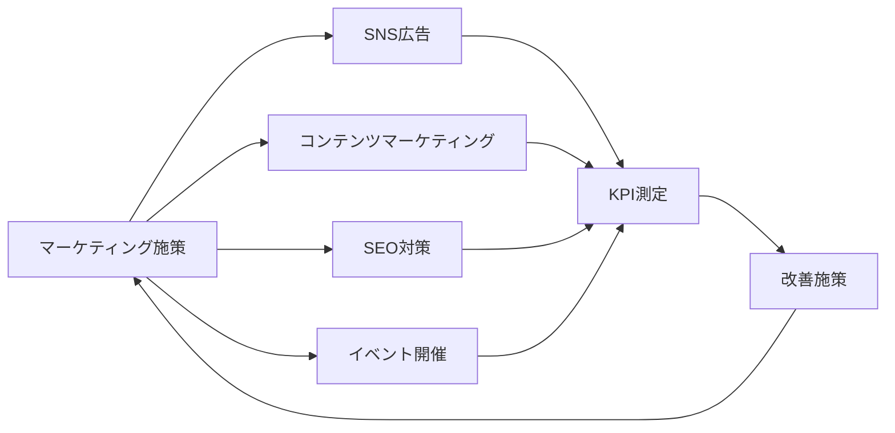

#### 収益モデル:
* [プロダクトの収益源（例：有料会員、広告収入、課金アイテム）を明確に記述。]
* [価格設定、課金体系、収益予測などを記述。]

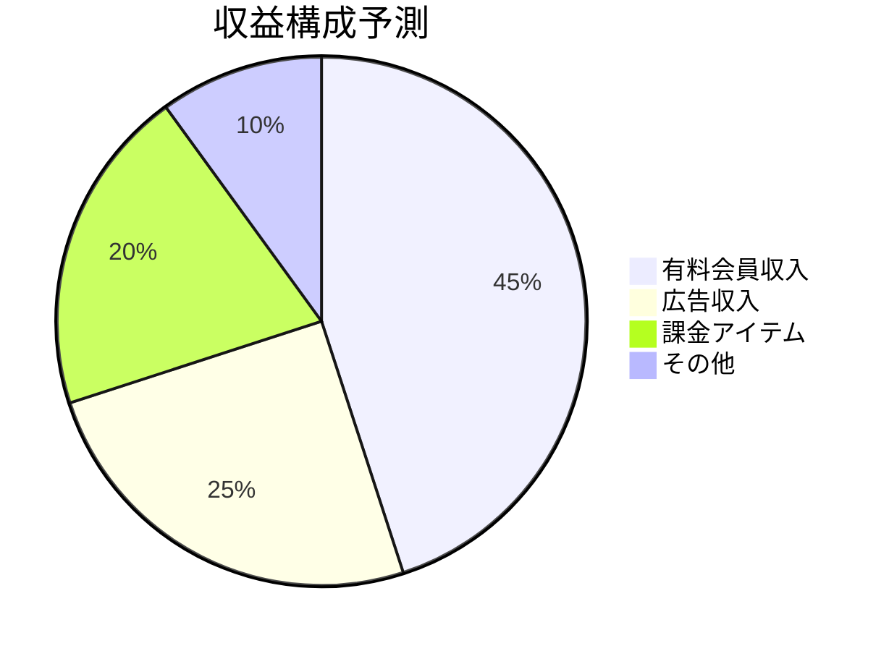

### 2.3 成功指標 (KPI・OKR)
**(この章では、プロダクトの成功を客観的に評価するための指標を設定します。顧客の課題解決とビジネスの成功の両立という最も重要な目標が達成されているかを定期的に確認し、必要に応じて改善を行うために、明確な指標が必要です。)**

* [プロダクトの成功を測るためのKPI（Key Performance Indicator）を設定。]
    * 例：ユーザー数、アクティブユーザー率、コンバージョン率、顧客満足度、売上、利益など。
* [KPIの目標値を設定（例：〇〇ヶ月以内に〇〇％向上）。]
* [KPIの計測方法、計測頻度、担当者を記述。]
* [OKR（Objectives and Key Results）を設定する場合は、Objective（目標）とKey Results（主要な成果）を具体的に記述。]

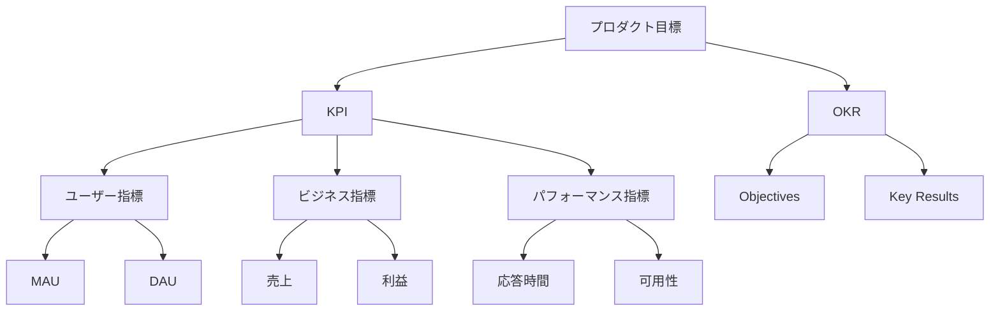

### 2.4 フレームワークの活用
**(このセクションでは、アイデア創出・企画フェーズで役立つフレームワークを紹介し、それぞれの活用方法と選択の指針を示します。)**


#### ジョブ理論 (JTBD):
* **目的:** 顧客がプロダクトを「雇用」する理由（ジョブ）を理解し、顧客の根本的な動機を明らかにする。
* **使い方:**
    1. ターゲット顧客を特定する。
    2. 顧客がプロダクトを利用する状況（コンテキスト）を把握する。
    3. 顧客がプロダクトを利用する動機（目的）を深掘りする。
    4. 顧客がプロダクトを利用することで達成したい結果（アウトカム）を明確にする。
    5. 顧客がプロダクトを利用するのを妨げる要因（阻害要因）を特定する。
    6. 上記をジョブステートメントの形式で記述する。
* **メリット:** 表面的なニーズだけでなく、顧客の根本的な動機を理解できる。
* **デメリット:** 顧客の動機を深掘りするため、時間と労力がかかる場合がある。
* **事例:** Airbnbは、旅行者が「現地の人のように滞在したい」というジョブを達成するために、宿泊施設を提供するプラットフォームを開発した。
* **選択の指針:** 顧客のニーズが多様で、表面的なニーズだけではプロダクトの価値を定義できない場合に有効。

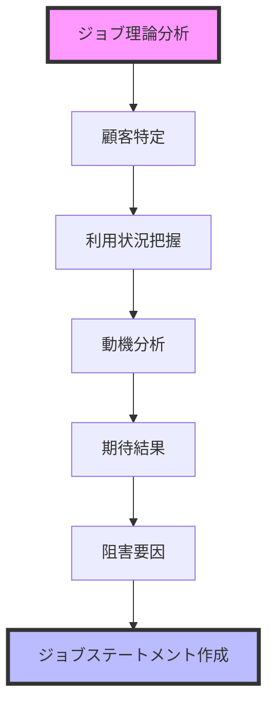

#### ビジネスモデルキャンバス (BMC):
* **目的:** プロダクトのビジネスモデルを9つの要素に分解し、可視化することで、ビジネスモデル全体の整合性を確認し、改善点を見つける。
* **使い方:**
    1. 9つの要素（顧客セグメント、価値提案、チャネル、顧客との関係、収益の流れ、リソース、主要活動、パートナー、コスト構造）をそれぞれ記述する。
    2. 各要素間の関係性を明確にし、矛盾や抜け漏れがないかを確認する。
    3. ビジネスモデルの強み・弱みを分析し、改善点を見つける。
* **メリット:** ビジネスモデル全体を俯瞰的に把握できる。
* **デメリット:** 各要素を具体的に記述する必要があるため、詳細な情報が必要となる。
* **事例:** Uberは、BMCを活用して、タクシー業界の課題を解決する新しいビジネスモデルを構築した。
* **選択の指針:** プロダクトのビジネスモデルを明確にし、関係者間で共有したい場合に有効。

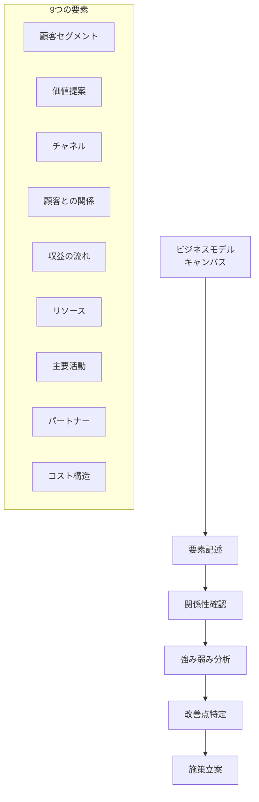

#### MoSCoW分析:
* **目的:** 機能の優先順位付けを行い、限られたリソースをどこに集中させるべきかを明確にする。
* **使い方:**
    1. プロダクトに必要な機能をリストアップする。
    2. 各機能をMust have（必須）、Should have（推奨）、Could have（できれば）、Won't have（今回は見送り）の4つのカテゴリに分類する。
    3. Must haveの機能を最優先で開発し、Should have、Could haveの機能は、リソースやスケジュールの状況に応じて開発する。
* **メリット:** 機能の優先順位を明確にし、開発の効率化を図ることができる。
* **デメリット:** 機能の重要性を主観的に判断する必要があるため、関係者間で合意形成が必要となる場合がある。
* **事例:** 新規ECサイトの開発において、MoSCoW分析を用いて、商品検索、カート、決済などの機能をMust haveとし、レビュー機能やレコメンド機能をShould haveとした。
* **選択の指針:** プロダクトの初期リリース（MVP）で、どの機能を実装すべきかを決定する際に有効。

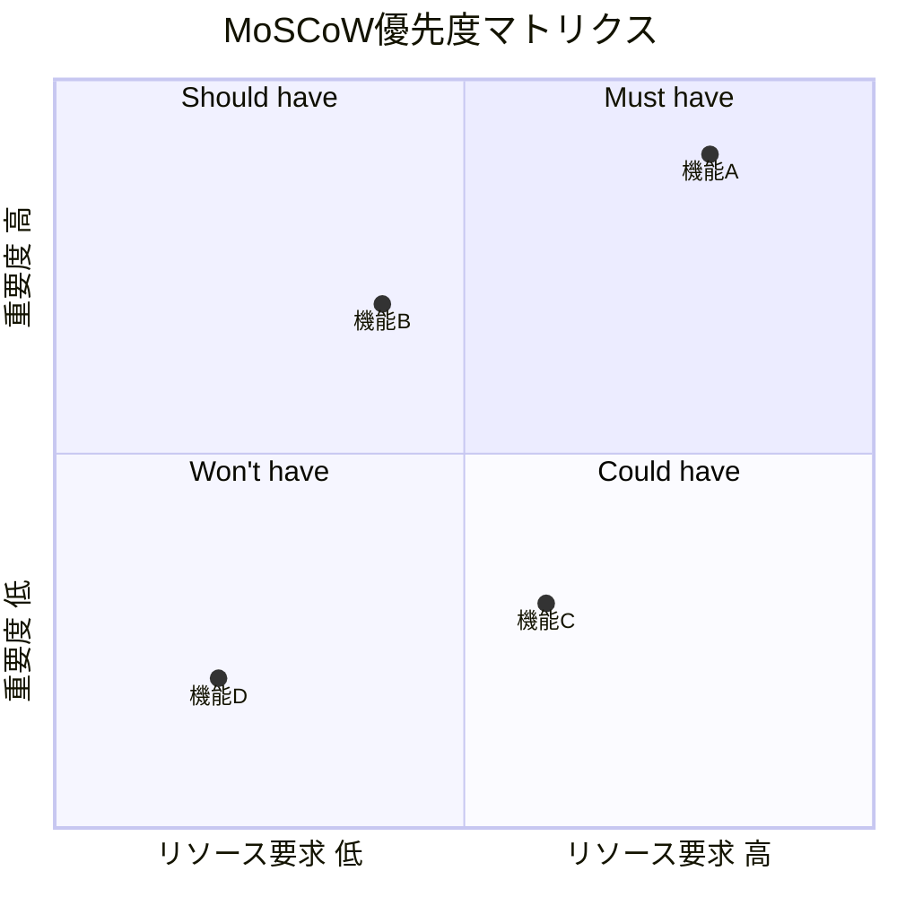

**(その他のフレームワーク: 必要に応じて、ペルソナ、カスタマージャーニーマップ、SWOT分析などのフレームワークを追加)**


## 3. PRD (Product Requirements Document)

### 3.1 製品コンセプト / スコープ定義
**(この章では、PRDの中でも最も基本的かつ重要な情報を記載します。具体的には、製品が何を目指し、何を実現するのかというコンセプトを明瞭にし、今回の開発やリリースにおいて、どこまでの範囲を対象とするのかというスコープを明確にします。)**

#### 製品コンセプト:
* [プロダクトを一言で表すキャッチフレーズやスローガン。]
* [プロダクトの概要、提供する価値、ターゲットユーザー、競合製品との違いなどを簡潔に記述。]

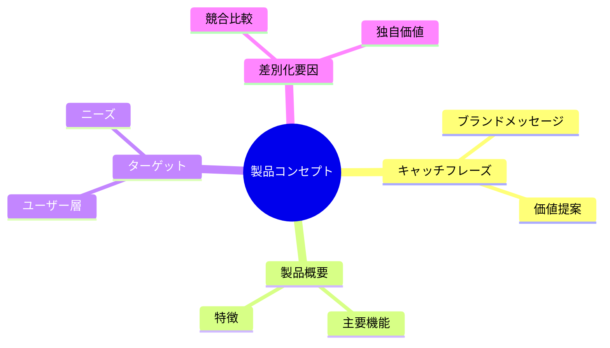

#### スコープ定義:
* [MVP（Minimum Viable Product）の範囲を明確に定義。]
* [Must have（必須）、Should have（推奨）、Could have（できれば）、Won't have（今回は見送り）の4つのカテゴリで機能を分類（MoSCoW分析）。]
* [スコープ外の機能や要望を明確に記述（将来的な拡張の可能性も考慮）。]

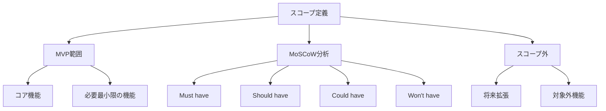

### 3.2 機能要件
**(この章では、製品が提供する具体的な機能について詳細に記述します。ユーザーが製品を使って何ができるのか、どのような操作を行うのかを明確にすることで、開発チームが正しく機能を実装できるようにします。)**

#### ユーザーストーリーマッピング:
* [ユーザーがプロダクトを利用する一連の流れを時系列で可視化。]
* [各ステップでユーザーが何をするか、何を感じるか、どのような課題があるかを記述。]
* [ユーザーストーリーを抽出（「[役割]として、[機能]が欲しい。それは[理由]のためだ。」）。]

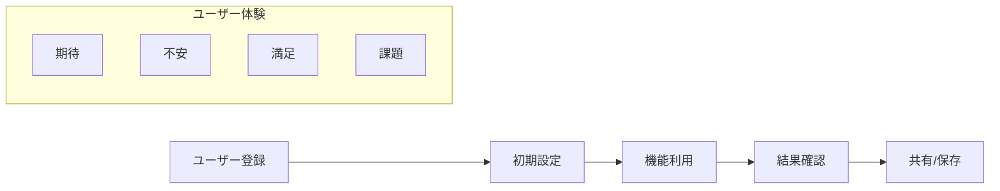

#### 機能一覧:
* [各機能の概要、優先度（MoSCoW分析の結果）、関連するユーザーストーリー、担当者などを表形式で記述。]
* [各機能の入力、処理、出力（データ、画面表示など）を明確に記述。]

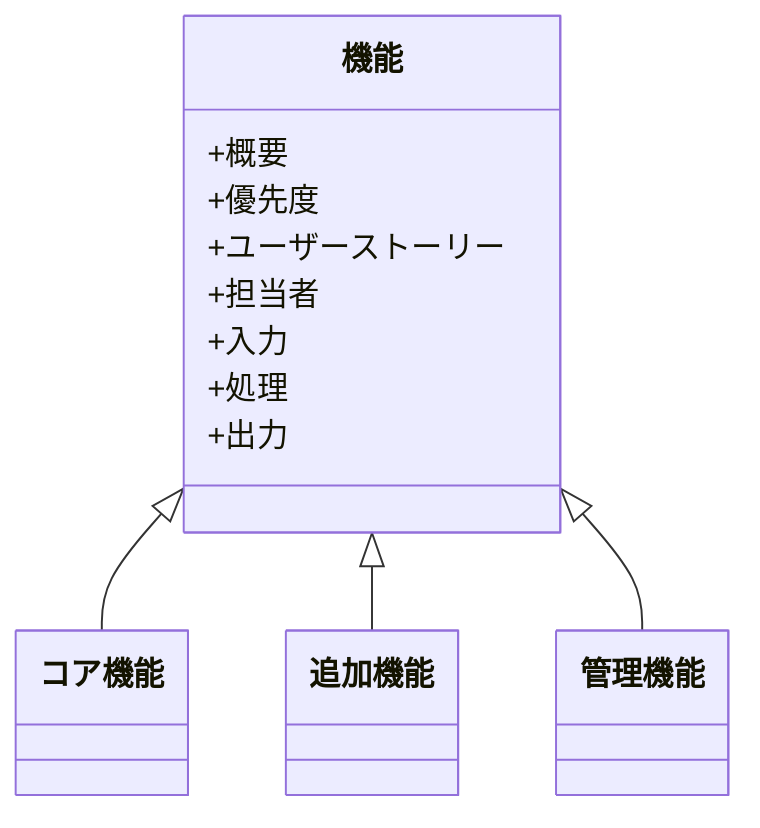


#### 画面遷移図:
* [ユーザーがプロダクトを利用する際の画面の流れを、図で表現。]
* [各画面のタイトル、主要な要素、画面間の遷移条件（ボタンクリック、時間経過など）を記述。]

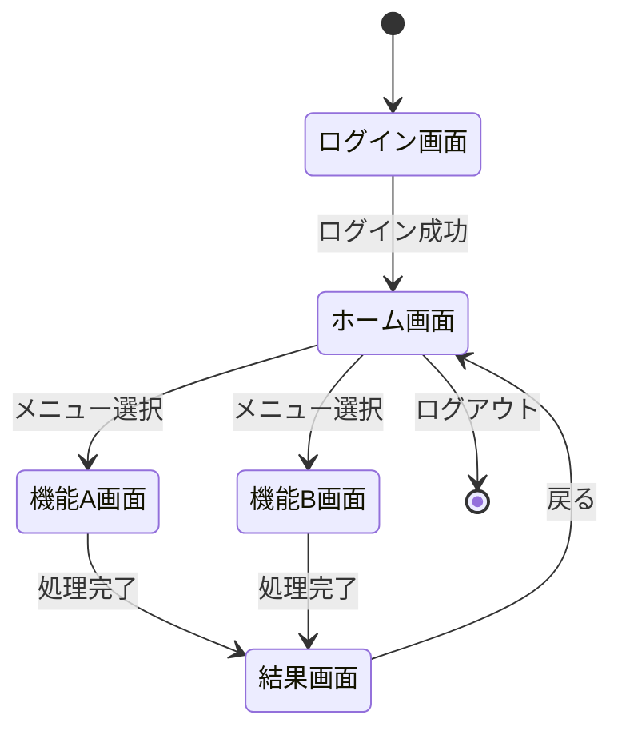

#### ワイヤーフレーム:
* [各画面のレイアウト、構成要素（ボタン、テキストフィールド、画像など）を簡略的に表現。]
* [ユーザーインターフェースの初期デザイン。]

### 3.3 非機能要件
**(機能要件が「何をするか」を定義するのに対し、非機能要件は「どのようにするか」を定義します。性能、セキュリティ、拡張性、運用性など、製品の品質に関わる重要な要件です。)**

#### 性能要件:
* [応答時間、スループット、同時接続数などの目標値を具体的に記述。]
* [負荷テスト、パフォーマンステストの計画を記述。]

```mermaid
graph TB
    A[性能要件] --> B[応答時間]
    A --> C[スループット]
    A --> D[同時接続数]
    
    B --> E[画面表示 3秒以内]
    B --> F[API応答 1秒以内]
    
    C --> G[1000リクエスト/秒]
    
    D --> H[1万同時接続]
```

#### セキュリティ要件:
* [認証・認可、暗号化、脆弱性対策、個人情報保護などの要件を具体的に記述。]
* [セキュリティテスト（脆弱性診断、ペネトレーションテスト）の計画を記述。]
* [適用するセキュリティ基準やガイドライン（例：OWASP Top 10、NIST Cybersecurity Framework）を明記。]

```mermaid
mindmap
  root((セキュリティ要件))
    認証・認可
      多要素認証
      アクセス制御
    暗号化
      通信暗号化
      データ暗号化
    脆弱性対策
      OWASP Top 10
      セキュリティテスト
    個人情報保護
      データ保護
      アクセスログ
```


#### 拡張性:
* [将来的な機能追加やユーザー数の増加に対応できる設計になっているかを記述。]
* [APIの設計、モジュール化、疎結合などの考慮事項を記述。]

```mermaid
graph TB
    A[拡張性設計] --> B[スケーラビリティ]
    A --> C[モジュール化]
    A --> D[API設計]
    
    B --> E[水平スケール]
    B --> F[垂直スケール]
    
    C --> G[疎結合]
    C --> H[高凝集]
    
    D --> I[RESTful API]
    D --> J[マイクロサービス]
```

#### 運用性:
* [監視、ログ収集、バックアップ、障害対応などの運用プロセスを記述。]
* [運用に必要なツール（例：監視ツール、ログ管理ツール）を記載。]

```mermaid
mindmap
  root((運用管理))
    システム監視
      リソース監視
      パフォーマンス監視
    ログ管理
      収集
      分析
      保管
    バックアップ
      定期バックアップ
      リストア手順
    障害対応
      検知
      対応
      報告
```

#### DR (Disaster Recovery) 対策:
* [災害発生時のシステム復旧計画を記述。]
* [バックアップデータの保管場所、復旧手順、目標復旧時間（RTO）、目標復旧時点（RPO）などを記述。]

```mermaid
graph LR
    A[災害発生] --> B[初期対応]
    B --> C[影響評価]
    C --> D[復旧計画実行]
    D --> E[システム復旧]
    E --> F[検証]
    F --> G[平常運用再開]
    
    subgraph 目標値
    H[RTO: 2時間以内]
    I[RPO: 5分以内]
    end
```

#### 法務要件:
* [個人情報保護法、GDPR、CCPAなどの関連法規制への対応状況を記述。]
* **[個人情報保護に関する同意取得の方法（オプトイン、オプトアウト）や、データ主体の権利（アクセス権、訂正権、削除権など）への対応方法を具体的に記述。]**
* [利用規約、プライバシーポリシー、特定商取引法に基づく表示などの作成・更新プロセスを記述。]
* [知的財産権（著作権、商標権、特許権）の保護に関する事項を記述。]

```mermaid
mindmap
  root((法務要件))
    個人情報保護
      GDPR対応
      CCPA対応
      国内法対応
    データ主体の権利
      アクセス権
      訂正権
      削除権
    法的文書
      利用規約
      プライバシーポリシー
      特商法表示
    知的財産
      著作権
      商標権
      特許権
```

### 3.4 リスクと制約事項
**(開発プロジェクトには、さまざまなリスクや制約がつきものです。この章では、事前にそれらを洗い出し、対応策を検討しておくことで、プロジェクトの成功確率を高めます。)**


#### 想定リスク:
* [技術的なリスク（例：技術的な課題、開発の遅延、パフォーマンスの問題）、市場リスク（例：競合の激化、市場の変化）、法務・コンプライアンスリスク（例：法規制違反、訴訟）、セキュリティリスク（例：情報漏洩、不正アクセス）などをリストアップ。]
* [各リスクの発生確率、影響度、対策案（回避、軽減、転嫁、受容）を記述。]

```mermaid
quadrantChart
    title リスク評価マトリクス
    x-axis "発生確率 低" --> "発生確率 高"
    y-axis "影響度 低" --> "影響度 高"
    quadrant-1 "重点対応"
    quadrant-2 "要注意"
    quadrant-3 "要監視"
    quadrant-4 "許容範囲"
    "技術リスクA": [0.8, 0.9]
    "市場リスクB": [0.6, 0.5]
    "法務リスクC": [0.3, 0.8]
    "セキュリティリスクD": [0.7, 0.7]
```

#### 制約事項:
* [予算、スケジュール、リソース（人員、技術、設備）、技術的な制約、法規制などの制約事項を記述。]
* [制約事項がプロダクト開発に与える影響を分析。]

```mermaid
mindmap
  root((制約事項))
    予算
      開発予算
      運用予算
    スケジュール
      開発期間
      マイルストーン
    リソース
      人員
      技術
      設備
    技術制約
      開発言語
      インフラ環境
    法規制
      コンプライアンス
      業界規制
```

### 3.5 スケジュール / リリース計画
**(開発プロジェクトを円滑に進めるためには、明確なスケジュールとリリース計画が必要です。この章では、いつまでに何を完了させるのか、どのようにリリースするのかを具体的に記述します。)**

#### マイルストーン:
* [プロジェクトの主要なマイルストーン（例：α版リリース、β版リリース、正式リリース）を設定。]
* [各マイルストーンの達成基準（Definition of Done）を明確に記述。]

```mermaid
gantt
    title プロジェクトスケジュール
    dateFormat  YYYY-MM-DD
    section 開発フェーズ
    要件定義     :2024-01-01, 30d
    設計         :2024-02-01, 45d
    実装         :2024-03-15, 60d
    テスト       :2024-05-15, 30d
    section リリース
    α版         :2024-06-15, 15d
    β版         :2024-07-01, 30d
    正式リリース :2024-08-01, 15d
```


#### スケジュール:
* [各タスク（要件定義、設計、開発、テスト、リリース）の開始日、終了日、担当者をガントチャートなどで可視化。]
* [クリティカルパスを特定し、遅延のリスクを管理。]

```mermaid
graph TB
    A[スケジュール管理] --> B[タスク定義]
    A --> C[工数見積]
    A --> D[リソース配分]
    
    B --> E[WBS作成]
    C --> F[クリティカルパス分析]
    D --> G[担当者アサイン]
    
    E --> H[進捗管理]
    F --> H
    G --> H
```

#### リリース計画:
* [リリース形態（α版、β版、正式リリース）と時期の見込みを記述。]
* [リリース対象ユーザー（限定公開、一般公開など）を記述。]
* [リリース後のサポート体制、メンテナンス計画を記述。]

```mermaid
stateDiagram-v2
    [*] --> α版
    α版 --> β版: 主要機能実装完了
    β版 --> 正式リリース: 品質基準達成
    正式リリース --> 継続的改善
    
    state α版 {
        [*] --> 内部テスト
        内部テスト --> 限定ユーザーテスト
    }
    
    state β版 {
        [*] --> パブリックβ
        パブリックβ --> フィードバック収集
    }
    
    state 正式リリース {
        [*] --> 一般公開
        一般公開 --> 運用保守
    }
```

## 4. 各仕様書（詳細要件定義）
**(この章では、PRDで定義された要件をさらに詳細化し、具体的な設計レベルの情報を記述します。機能仕様書、デザイン仕様書、技術仕様書など、開発に必要な情報を網羅します。)**

### 4.1 機能仕様書
* [各画面の機能、UI要素、エラー表示、状態遷移などを詳細に記述。]
* [画面ごとに、以下の項目を記述：]
    * **画面名:**
    * **画面ID:**
    * **画面の目的:**
    * **関連するユーザーストーリー:**
    * **画面レイアウト:**（ワイヤーフレーム、モックアップ、デザインデータへのリンク）
    * **UI要素:**（各要素の名称、種類、動作、入力制限、表示条件などを記述）
    * **エラーメッセージ:**（エラーの種類、表示タイミング、表示内容などを記述）
    * **画面遷移:**（遷移元、遷移先、遷移条件などを記述）
    * **ビジネスロジック:**（データの取得、加工、保存などの処理内容を記述）
    * **バリデーションルール:**（入力値のチェックルールを記述）
* [必要に応じて、フローチャート、状態遷移図、シーケンス図などを用いて、処理の流れを可視化。]

```mermaid
classDiagram
    class 画面仕様 {
        +画面ID: String
        +画面名: String
        +目的: String
        +ユーザーストーリー: String
        +レイアウト: Layout
        +UI要素: List<UIElement>
        +エラーメッセージ: List<Error>
        +画面遷移: List<Transition>
        +ビジネスロジック: List<Process>
        +バリデーション: List<Rule>
    }
    
    class UIElement {
        +要素ID: String
        +種類: ElementType
        +動作: Behavior
        +入力制限: List<Constraint>
        +表示条件: Condition
    }
    
    画面仕様 "1" *-- "many" UIElement
```


### 4.2 デザイン仕様書

#### デザインシステム:
* [カラーパレット、フォント、タイポグラフィ、アイコン、UIコンポーネント（ボタン、フォーム、モーダルなど）のスタイルガイドを定義。]
* [コンポーネントの再利用性、一貫性を確保。]

```mermaid
mindmap
  root((デザインシステム))
    カラー
      プライマリ
      セカンダリ
      アクセント
    タイポグラフィ
      フォント
      サイズ
      行間
    コンポーネント
      ボタン
      フォーム
      モーダル
    アイコン
      システム
      機能
      ナビゲーション
```

#### ユーザビリティガイドライン:
* [ユーザーインターフェースの設計原則（例：わかりやすさ、使いやすさ、一貫性、効率性）を記述。]
* [アクセシビリティ対応（WCAGなど）の要件を記述。]

```mermaid
graph TB
    A[ユーザビリティ<br>ガイドライン] --> B[設計原則]
    A --> C[アクセシビリティ]
    
    B --> D[わかりやすさ]
    B --> E[使いやすさ]
    B --> F[一貫性]
    B --> G[効率性]
    
    C --> H[WCAG準拠]
    C --> I[スクリーンリーダー対応]
    C --> J[キーボード操作]
    C --> K[コントラスト比]
```

#### デザインデータ:
* [高解像度のデザインデータ（Figma、Adobe XDなど）へのリンクを記載。]
* [デザインデータのバージョン管理方法を記述。]


### 4.3 技術仕様書 / アーキテクチャ

#### システム構成図:
* [サーバー、データベース、ネットワーク、外部サービス/APIなどの構成要素を、図で表現。]
* [各要素間の関係性（データの流れ、通信プロトコルなど）を記述。]
* [冗長化、負荷分散、フェイルオーバーなどの構成を記述。]

```mermaid
graph TB
    subgraph クライアント層
    A[Webブラウザ]
    B[モバイルアプリ]
    end
    
    subgraph アプリケーション層
    C[ロードバランサー]
    D[Webサーバー1]
    E[Webサーバー2]
    end
    
    subgraph データ層
    F[プライマリDB]
    G[レプリカDB]
    H[キャッシュ]
    end
    
    A --> C
    B --> C
    C --> D
    C --> E
    D --> F
    D --> H
    E --> F
    E --> H
    F --> G
```

#### データモデル（ER図）:
* [データベースのテーブル構造、リレーションシップをER図で表現。]
* [各テーブルの属性（カラム名、データ型、制約など）を定義。]

```mermaid
erDiagram
    USER ||--o{ ORDER : places
    USER {
        string user_id PK
        string name
        string email
        timestamp created_at
    }
    ORDER ||--|{ ORDER_ITEM : contains
    ORDER {
        string order_id PK
        string user_id FK
        decimal total_amount
        string status
        timestamp order_date
    }
    ORDER_ITEM {
        string order_item_id PK
        string order_id FK
        string product_id FK
        integer quantity
        decimal price
    }
    PRODUCT ||--o{ ORDER_ITEM : includes
    PRODUCT {
        string product_id PK
        string name
        string description
        decimal price
        integer stock
    }
```

#### API仕様:
* [外部サービスやクライアントアプリケーションとの連携に使用するAPIのエンドポイント、リクエスト/レスポンスの形式、認証方式などを記述。]
* [APIドキュメント（Swagger、OpenAPI Specificationなど）へのリンクを記載。]

```mermaid
graph TB
    A[API仕様] --> B[エンドポイント定義]
    A --> C[認証・認可]
    A --> D[データフォーマット]
    
    B --> E[RESTful API]
    B --> F[WebSocket]
    
    C --> G[JWT認証]
    C --> H[OAuth2.0]
    
    D --> I[リクエスト形式]
    D --> J[レスポンス形式]
    D --> K[エラーハンドリング]
```


#### インフラ構成:
* [使用するクラウドサービス（AWS、Azure、GCPなど）、サーバーのスペック、ネットワーク構成、セキュリティ設定などを記述。]
* [インフラの構築・管理方法（Infrastructure as Codeなど）を記述。]
* **[開発環境、ステージング環境、本番環境のそれぞれのIPアドレス、URL、接続情報などを具体的に記述する表を追加。]**

```mermaid
graph TB
    subgraph AWS Cloud
        subgraph VPC
            subgraph Public Subnet
                ALB[Application Load Balancer]
                BAS[Bastion Host]
            end
            
            subgraph Private Subnet
                EC2[EC2 Instances]
                RDS[RDS Database]
                ELS[Elasticsearch]
            end
        end
        
        S3[S3 Bucket]
        CDN[CloudFront]
    end
    
    Internet((Internet)) --> CDN
    CDN --> S3
    CDN --> ALB
    ALB --> EC2
    EC2 --> RDS
    EC2 --> ELS
    BAS --> EC2
```

#### 技術選定:
* [利用するプログラミング言語、フレームワーク、ライブラリ、ミドルウェア、開発ツールなどの技術選定理由を記述。]

```mermaid
mindmap
  root((技術スタック))
    フロントエンド
      React
      TypeScript
      TailwindCSS
    バックエンド
      Node.js
      Express
      TypeORM
    データベース
      PostgreSQL
      Redis
    インフラ
      AWS
      Docker
      Kubernetes
    CI/CD
      GitHub Actions
      ArgoCD
    監視
      Prometheus
      Grafana
```

## 5. テスト計画 / QA

### 5.1 テスト計画概要
**(この章では、製品の品質を保証するためのテスト計画について記述します。どのようなテストを、いつ、誰が、どのように行うのかを明確にし、テストの抜け漏れを防ぎます。)**


#### テストフェーズ:
* [単体テスト（ユニットテスト）、結合テスト、システムテスト、受け入れテスト（UAT）などのテストフェーズを定義。]
* [各フェーズの目的、実施内容、実施時期、担当者、完了基準を記述。]

```mermaid
graph TB
    A[テストフェーズ] --> B[単体テスト]
    A --> C[結合テスト]
    A --> D[システムテスト]
    A --> E[受け入れテスト]
    
    B --> F[開発者]
    C --> G[QAチーム]
    D --> G
    E --> H[ステークホルダー]
    
    subgraph 完了基準
        I[カバレッジ80%以上]
        J[重大バグ0件]
        K[性能要件達成]
        L[ユーザー承認]
    end
    
    B --> I
    C --> J
    D --> K
    E --> L
```

#### テスト環境:
* [開発環境、ステージング環境、本番環境などのテスト環境を定義。]
* [各環境の構成、利用目的、利用ルールを記述。]
* [CI/CD（継続的インテグレーション/継続的デリバリー）のパイプラインを構築する場合は、その構成と運用方法を記述。]

```mermaid
flowchart LR
    A[開発環境] --> B[ステージング環境] --> C[本番環境]
    
    subgraph CI/CDパイプライン
        D[コード変更] --> E[ビルド]
        E --> F[単体テスト]
        F --> G[結合テスト]
        G --> H[デプロイ]
    end
    
    F --> A
    G --> B
    H --> C
```

### 5.2 テスト仕様書
**(この章では、具体的にどのようなテストを行うのかを詳細に記述します。テスト項目、テストケース、期待結果などを明確にすることで、テストの実行と結果の評価を正確に行うことができます。)**

#### テスト項目一覧:
* [各機能、画面、APIなどに対して、テスト項目をリストアップ。]
* [各テスト項目のID、概要、テスト手順、期待結果、関連する要件（ユーザーストーリー、機能仕様など）を記述。]

```mermaid
mindmap
  root((テスト項目))
    機能テスト
      ユーザー登録
      ログイン
      データ処理
    画面テスト
      レイアウト
      レスポンシブ
      表示速度
    APIテスト
      エンドポイント
      認証
      エラー処理
    非機能テスト
      性能
      セキュリティ
      使用性
```


#### テストケース:
* [各テスト項目に対して、具体的なテストケース（入力値、操作手順、期待される結果）を記述。]
* [正常系、異常系、境界値などのテストケースを網羅。]

```mermaid
graph TB
    A[テストケース] --> B[正常系]
    A --> C[異常系]
    A --> D[境界値]
    
    B --> E[一般的な操作]
    B --> F[標準的なデータ]
    
    C --> G[不正な入力]
    C --> H[エラー処理]
    
    D --> I[最小値]
    D --> J[最大値]
    D --> K[境界条件]
```

#### バグ管理:
* [バグ管理ツール（JIRA、Redmineなど）の使用方法を記述。]
* [バグの報告、優先度付け、担当者割り当て、進捗管理、修正確認などのプロセスを記述。]
* [バグの優先度基準（例：致命的、重大、軽微）を定義。]

```mermaid
stateDiagram-v2
    [*] --> バグ報告
    バグ報告 --> トリアージ
    トリアージ --> 優先度設定
    優先度設定 --> 担当者割当
    担当者割当 --> 修正中
    修正中 --> テスト
    テスト --> 完了: 修正確認OK
    テスト --> 修正中: 修正確認NG
    完了 --> [*]
```

#### リグレッションテスト:
* [機能追加や修正によって、既存の機能に影響がないかを確認するためのリグレッションテストの実施計画を記述。]
* [自動化の範囲、実施頻度、担当者などを記述。]

```mermaid
graph LR
    A[コード変更] --> B[自動テスト実行]
    B --> C{テスト結果}
    C -->|成功| D[変更リリース]
    C -->|失敗| E[影響分析]
    E --> F[修正]
    F --> B
```

### 5.3 セキュリティテスト / パフォーマンステスト
**(この章では、セキュリティとパフォーマンスという、製品の品質にとって特に重要な側面について、どのようなテストを行うのかを記述します。)**


#### セキュリティテスト:
* [脆弱性診断（SQLインジェクション、XSS、CSRFなどの脆弱性チェック）の実施計画を記述。]
* [ペネトレーションテスト（外部からの攻撃シミュレーション）の実施計画を記述。]
* [セキュリティテストツール（OWASP ZAP、Burp Suiteなど）の使用方法を記述。]

```mermaid
mindmap
  root((セキュリティ<br>テスト))
    脆弱性診断
      SQLインジェクション
      XSS
      CSRF
    ペネトレーション
      認証バイパス
      権限昇格
      情報漏洩
    ツール活用
      OWASP ZAP
      Burp Suite
      Network Scanner
    コンプライアンス
      GDPR
      PCI DSS
      ISO 27001
```

```mermaid
graph TB
    A[セキュリティテスト計画] --> B[静的解析]
    A --> C[動的解析]
    A --> D[手動テスト]
    
    B --> E[コード解析]
    B --> F[設定チェック]
    
    C --> G[自動スキャン]
    C --> H[ファジング]
    
    D --> I[ペネトレーション]
    D --> J[セキュリティレビュー]
```

#### パフォーマンステスト:
* [負荷テスト（同時接続数、リクエスト数などを増加させて、システムの性能を測定）の実施計画を記述。]
* [ストレステスト（システムの限界を超える負荷をかけて、耐久性を確認）の実施計画を記述。]
* [パフォーマンステストツール（JMeter、LoadRunnerなど）の使用方法を記述。]

```mermaid
graph LR
    A[パフォーマンス<br>テスト] --> B[負荷テスト]
    A --> C[ストレステスト]
    A --> D[耐久性テスト]
    
    B --> E[レスポンス時間]
    B --> F[スループット]
    
    C --> G[限界値測定]
    C --> H[障害回復]
    
    D --> I[長期安定性]
    D --> J[リソース消費]
    
    subgraph 測定指標
        K[CPU使用率]
        L[メモリ使用量]
        M[ディスクI/O]
        N[ネットワーク帯域]
    end
```

## 6. 運用・監視計画
**(製品をリリースした後も、安定して稼働させ、ユーザーに価値を提供し続けるためには、適切な運用と監視が必要です。この章では、運用プロセス、障害対応、ログ収集、データ管理、災害対策などについて記述します。)**

### 6.1 運用プロセス


#### リリース後の運用フロー:
* [定期的なメンテナンス（サーバーの再起動、アップデート、バックアップなど）のスケジュールと手順を記述。]
* [ユーザーからの問い合わせ対応、障害対応などのプロセスを記述。]

```mermaid
stateDiagram-v2
    [*] --> 日次運用
    日次運用 --> 定期メンテナンス: スケジュール到来
    定期メンテナンス --> 日次運用: 完了
    日次運用 --> インシデント対応: 障害発生
    インシデント対応 --> 日次運用: 解決
    
    state 日次運用 {
        [*] --> 監視確認
        監視確認 --> バックアップ確認
        バックアップ確認 --> ログ確認
        ログ確認 --> [*]
    }
    
    state インシデント対応 {
        [*] --> 一次対応
        一次対応 --> 原因分析
        原因分析 --> 対策実施
        対策実施 --> 再発防止
    }
```

#### 障害時対応フロー:
* [障害発生時の検知、連絡、対応、復旧、報告などの手順を記述。]
* [障害対応の担当者、連絡先、エスカレーションパスを記述。]
* [障害対応の記録方法、分析方法を記述。]

```mermaid
flowchart TB
    A[障害検知] --> B{重要度判定}
    B -->|重大| C[緊急連絡]
    B -->|軽微| D[通常対応]
    
    C --> E[対策本部設置]
    D --> F[担当者対応]
    
    E --> G[状況分析]
    F --> G
    
    G --> H[対応策実施]
    H --> I[復旧確認]
    I --> J[報告書作成]
    
    subgraph エスカレーション
    K[一次対応者]
    L[技術責任者]
    M[経営層]
    K --> L --> M
    end
```

#### 監視ツール:
* [使用する監視ツール（Zabbix、Nagios、Prometheus、Grafana、CloudWatchなど）を記載。]
* [監視対象（サーバー、ネットワーク、アプリケーション、ログなど）を記述。]
* [監視項目、閾値、アラート通知設定などを記述。]

```mermaid
mindmap
  root((監視計画))
    インフラ監視
      サーバーリソース
      ネットワーク状態
      ストレージ容量
    アプリケーション監視
      エラー率
      レスポンスタイム
      セッション数
    ログ監視
      エラーログ
      アクセスログ
      セキュリティログ
    アラート設定
      即時通知
      定期レポート
      エスカレーション
```


#### SLA / SLO (サービスレベル合意・目標):
* [サービスレベル目標（SLO）とサービスレベル合意（SLA）を設定。]
    * 例：稼働率、応答時間、障害対応時間など。
* [SLO/SLAの計測方法、報告方法を記述。]

```mermaid
graph TB
    A[サービスレベル管理] --> B[SLA定義]
    A --> C[SLO設定]
    A --> D[計測・モニタリング]
    
    B --> E[契約要件]
    B --> F[ペナルティ]
    
    C --> G[技術目標]
    C --> H[運用目標]
    
    D --> I[定期報告]
    D --> J[改善活動]
    
    subgraph SLA項目
    K[稼働率 99.9%]
    L[応答時間 1秒以内]
    M[障害対応 30分以内]
    end
```

### 6.2 ログ収集・分析 / データ管理

#### ログ収集:
* [収集するログの種類（アクセスログ、エラーログ、アプリケーションログなど）を記述。]
* [ログの収集方法、保管場所、保管期間を記述。]
* [ログ収集ツール（Fluentd、Logstash、CloudWatch Logsなど）の使用方法を記述。]

```mermaid
flowchart LR
    A[アプリケーション] --> B[ログ収集]
    C[インフラ] --> B
    D[セキュリティ] --> B
    
    B --> E[Fluentd/Logstash]
    E --> F[一時保存]
    F --> G[永続化]
    
    G --> H[ElasticSearch]
    G --> I[S3]
    
    H --> J[Kibana]
    I --> K[Athena]
    
    subgraph 分析基盤
    J
    K
    end
```

#### ログ分析:
* [ログの分析目的（障害分析、パフォーマンス改善、セキュリティ監視など）を記述。]
* [ログの分析方法、分析ツール（Elasticsearch、Kibana、Splunkなど）の使用方法を記述。]

```mermaid
mindmap
  root((ログ分析))
    障害分析
      エラー検出
      原因特定
      影響範囲
    パフォーマンス
      レスポンスタイム
      リソース使用率
      ボトルネック
    セキュリティ
      不正アクセス
      脆弱性
      攻撃パターン
    ユーザー行動
      アクセス傾向
      利用パターン
      離脱ポイント
```


#### データ管理:
* [データのバックアップ、リストア、アーカイブなどの手順を記述。]
* [データの保管場所、保管期間、アクセス権限などを記述。]
* [個人情報の取り扱いに関する規定（プライバシーポリシーとの整合性）を記述。]

```mermaid
graph TB
    A[データ管理] --> B[バックアップ]
    A --> C[アクセス制御]
    A --> D[データ保持]
    
    B --> E[フルバックアップ]
    B --> F[差分バックアップ]
    
    C --> G[役割ベース]
    C --> H[属性ベース]
    
    D --> I[保管期間]
    D --> J[アーカイブ]
    
    subgraph コンプライアンス
    K[個人情報保護]
    L[データセキュリティ]
    M[監査対応]
    end
```

### 6.3 DR (Disaster Recovery) 計画
* [災害発生時のシステム復旧計画を詳細に記述。]
* [バックアップデータの保管場所、復旧手順、目標復旧時間（RTO）、目標復旧時点（RPO）などを具体的に記述。]
* [定期的な復旧テスト（年1回以上など）の実施計画を記述。]
* [BCP（事業継続計画）との連携を考慮。]

```mermaid
stateDiagram-v2
    [*] --> 平常運用
    平常運用 --> 災害発生: インシデント検知
    災害発生 --> 初動対応
    初動対応 --> 影響評価
    影響評価 --> DRサイト起動
    DRサイト起動 --> システム復旧
    システム復旧 --> 検証
    検証 --> 本番切り戻し
    本番切り戻し --> 平常運用
    
    state DRサイト起動 {
        [*] --> バックアップ復元
        バックアップ復元 --> 環境構築
        環境構築 --> 動作確認
    }
```

```mermaid
gantt
    title DR訓練スケジュール
    dateFormat  YYYY-MM-DD
    section 準備
    環境確認     :2024-01-01, 7d
    手順書更新   :2024-01-08, 14d
    section 実施
    初動対応訓練 :2024-02-01, 3d
    復旧訓練     :2024-02-04, 5d
    section 評価
    結果分析     :2024-02-09, 7d
    改善計画     :2024-02-16, 14d
```

## 7. レビュー・承認フローと変更管理
**(ドキュメントや成果物の品質を維持し、関係者間での合意形成を円滑に進めるためには、明確なレビュー・承認フローと変更管理プロセスが必要です。この章では、誰が、いつ、何をレビューし、承認するのか、そして変更が発生した場合にどのように対応するのかを定義します。)**


### 7.1 レビュー体制
* [各ドキュメントや成果物（PRD、仕様書、デザイン、コードなど）のレビュー担当者、承認者を明確に記述。]
    * 例：プロダクトオーナー、プロジェクトマネージャー、デザイナー、エンジニア、QA、法務、セキュリティ担当者など。
    * [各担当者の役割と責任範囲を明確にする。（例：プロダクトオーナーはビジネス要件の観点からレビュー、技術リーダーは技術的な実現可能性の観点からレビュー）]
* [レビューのタイミング（例：各開発フェーズの完了時、スプリントの終了時、特定のマイルストーン到達時）を記述。]
* [レビューに使用するツール（例：JIRAのチケット、Confluenceのコメント機能、GitHubのプルリクエスト）を記載。]
* **[レビュー観点を明確化する。（例：要件定義レビューでは、要求に対して機能要件が網羅的か、非機能要件は明確か、実現可能か。デザインレビューでは、ユーザビリティ、アクセシビリティ、デザインガイドラインへの準拠。コードレビューでは、コーディング規約、可読性、保守性、セキュリティ。）]**

```mermaid
graph TB
    A[レビュー体制] --> B[要件レビュー]
    A --> C[デザインレビュー]
    A --> D[コードレビュー]
    A --> E[セキュリティレビュー]
    
    B --> F[プロダクトオーナー]
    B --> G[プロジェクトマネージャー]
    
    C --> H[デザイナー]
    C --> I[UX専門家]
    
    D --> J[技術リーダー]
    D --> K[シニアエンジニア]
    
    E --> L[セキュリティ担当]
    E --> M[法務担当]
```

```mermaid
gantt
    title レビュースケジュール
    dateFormat  YYYY-MM-DD
    section 要件
    PRDレビュー    :2024-01-01, 5d
    機能仕様レビュー :2024-01-06, 5d
    section デザイン
    UIレビュー     :2024-01-11, 3d
    UXレビュー     :2024-01-14, 3d
    section 実装
    コードレビュー  :2024-01-17, 10d
    セキュリティレビュー :2024-01-27, 5d
```

### 7.2 変更管理 / バージョン管理

#### ドキュメントの更新手順:
* [変更リクエストの起票方法（JIRAのチケット、専用の変更リクエストフォームなど）を記述。]
* [変更リクエストに必要な情報（変更内容、変更理由、影響範囲、優先度など）を明確にする。]
* [変更内容のレビュー・承認フローを記述。（誰がレビューし、誰が承認するか、承認に必要な基準は何か）]
    * **[承認者の役割（例：プロダクトオーナー、技術リーダー、法務担当者）と、それぞれの承認に必要な基準（例：ビジネス上の妥当性、技術的な実現可能性、法的なコンプライアンス）を明確に記述。]**
* [ドキュメントの更新担当者、更新履歴の記録方法を記述。]


```mermaid
stateDiagram-v2
    [*] --> 変更リクエスト
    変更リクエスト --> 影響分析
    影響分析 --> レビュー
    レビュー --> 承認判断
    承認判断 --> 変更実施: 承認
    承認判断 --> 差戻し: 要修正
    差戻し --> 変更リクエスト
    変更実施 --> 検証
    検証 --> リリース
    リリース --> [*]
    
    state レビュー {
        [*] --> ビジネスレビュー
        ビジネスレビュー --> 技術レビュー
        技術レビュー --> 法務レビュー
        法務レビュー --> [*]
    }
```

#### バージョン管理:
* [ドキュメント管理ツール（Confluence、Notionなど）やバージョン管理システム（Gitなど）の使用方法を記述。]
* [ドキュメントのバージョン番号の付け方（セマンティックバージョニングなど）を記述。]
* [リリースバージョンとドキュメントバージョンの対応関係を明確に記述。]
* [ブランチ戦略（Git-flow、GitHub Flowなど）を採用する場合は、その運用ルールを記述。]

```mermaid
graph TB
    A[バージョン管理] --> B[Git管理]
    A --> C[ドキュメント管理]
    
    B --> D[ブランチ戦略]
    B --> E[コミットルール]
    
    C --> F[バージョン番号]
    C --> G[履歴管理]
    
    D --> H[main]
    D --> I[develop]
    D --> J[feature]
    D --> K[release]
    
    F --> L[メジャー]
    F --> M[マイナー]
    F --> N[パッチ]
```

## 8. リスクマネジメント・コンプライアンス
**(プロジェクトの成功を脅かす可能性のあるリスクを早期に特定し、適切な対策を講じることは、プロジェクトを円滑に進める上で不可欠です。また、法規制や社内ポリシーを遵守し、コンプライアンスを確保することも重要です。この章では、リスク管理とコンプライアンスに関する事項を記述します。)**


### 8.1 リスク管理表（詳細版）
* [想定されるリスクを詳細にリストアップ。（技術的リスク、市場リスク、法務・コンプライアンスリスク、セキュリティリスク、運用リスクなど、多角的な視点から洗い出す）]
* [各リスクの発生確率、影響度、対策プラン（回避、軽減、転嫁、受容）、担当者を記述。]
* [リスクの評価基準（例：発生確率と影響度のマトリクス）を定義。]
* [定期的なリスクレビュー（例：週次、月次、またはプロジェクトのマイルストーンごと）の実施計画を記述。（レビューの参加者、アジェンダ、記録方法などを明確にする）]
* [リスクが顕在化した場合の対応手順（エスカレーションパス、関係者への連絡方法など）を記述。]

```mermaid
mindmap
  root((リスク<br>カテゴリ))
    技術リスク
      開発遅延
      技術的課題
      性能問題
    市場リスク
      競合参入
      需要変化
      価格変動
    法務リスク
      規制変更
      訴訟
      契約問題
    セキュリティ
      情報漏洩
      不正アクセス
      システム障害
    運用リスク
      人材不足
      コスト超過
      品質低下
```

```mermaid
graph TB
    A[リスク管理プロセス] --> B[リスク特定]
    B --> C[リスク評価]
    C --> D[対策立案]
    D --> E[モニタリング]
    E --> F[定期レビュー]
    F --> B
    
    subgraph 対策カテゴリ
    G[回避]
    H[軽減]
    I[転嫁]
    J[受容]
    end
    
    D --> G
    D --> H
    D --> I
    D --> J
```

### 8.2 法務・ライセンス / 規約
* [プロダクトに関連する法規制（個人情報保護法、GDPR、CCPA、特定商取引法、景品表示法、著作権法、特許法など）をリストアップ。]
* [各法規制への対応状況（準拠、一部準拠、未対応）を記述し、未対応の場合は対応計画を記述。]
* [利用規約、プライバシーポリシー、特定商取引法に基づく表示などの作成・更新状況を記述。（作成担当者、承認者、公開場所、更新履歴などを明確にする）]
* [外部の弁護士や専門家との連携状況を記述。（顧問契約の有無、相談内容、相談履歴などを記録）]
* [使用するOSS（オープンソースソフトウェア）のライセンスをリストアップし、各ライセンスの要件（著作権表示、ソースコード開示義務など）への対応状況を記述。]
* [商標、意匠、特許などの知的財産権の出願・登録状況を記述。]


```mermaid
graph TB
    A[法務コンプライアンス] --> B[法規制対応]
    A --> C[契約管理]
    A --> D[知的財産]
    
    B --> E[個人情報保護]
    B --> F[商取引法]
    B --> G[その他規制]
    
    C --> H[利用規約]
    C --> I[プライバシーポリシー]
    C --> J[ライセンス契約]
    
    D --> K[特許]
    D --> L[商標]
    D --> M[著作権]
    
    subgraph 対応状況管理
    N[準拠]
    O[一部準拠]
    P[未対応]
    Q[対応計画]
    end
```

### 8.3 情報セキュリティポリシー
* [社内の情報セキュリティポリシーへの準拠状況を記述。]
* [アクセス制御、データ暗号化、脆弱性管理、インシデント対応、ログ管理、物理セキュリティなどのセキュリティ対策を具体的に記述。]
* [従業員へのセキュリティ教育・訓練の実施状況を記述。（実施頻度、内容、対象者などを明確にする）]
* [情報セキュリティインシデント発生時の対応フローを記述。（検知、報告、初動対応、調査、復旧、再発防止策などの手順を明確にする）]
* [外部のセキュリティ専門家との連携状況を記述。（脆弱性診断、ペネトレーションテストの実施状況、セキュリティコンサルティングの利用状況など）]
* [セキュリティインシデント発生時の報告義務（個人情報保護委員会への報告など）について記述]

```mermaid
mindmap
  root((情報セキュリティ<br>管理))
    アクセス制御
      認証
      認可
      監査
    データ保護
      暗号化
      バックアップ
      廃棄
    脆弱性管理
      診断
      パッチ適用
      モニタリング
    インシデント対応
      検知
      分析
      復旧
    教育・訓練
      定期研修
      演習
      意識向上
```

## 9. 今後の展開 / ロードマップ
**(プロダクトはリリースして終わりではありません。継続的な改善、機能追加、市場の変化への対応など、長期的な視点での計画が必要です。この章では、リリース後の計画や将来の展望について記述します。)**


### 9.1 リリース後の改善計画
* [ユーザーからのフィードバック、KPIの分析結果、市場調査などに基づいて、継続的な改善計画を策定。（具体的な改善項目、優先順位、スケジュール、担当者などを記述）]
* [追加機能、改善要望、バグ修正などをリストアップし、優先順位付け（MoSCoW分析など）。]
* [各改善項目のリリース時期（v1.1、v1.2など）を計画。（ロードマップとして可視化することも有効）]
* [A/Bテストなどの手法を用いて、改善の効果を検証する計画を記述。]

```mermaid
gantt
    title 改善計画ロードマップ
    dateFormat  YYYY-MM-DD
    section v1.1
    バグ修正      :2024-01-01, 14d
    軽微な改善    :2024-01-15, 14d
    section v1.2
    主要機能追加  :2024-02-01, 30d
    UI/UX改善    :2024-03-01, 21d
    section v1.3
    新規機能開発  :2024-04-01, 45d
    パフォーマンス改善 :2024-05-15, 30d
```

```mermaid
graph TB
    A[改善サイクル] --> B[フィードバック収集]
    B --> C[分析・評価]
    C --> D[改善計画立案]
    D --> E[A/Bテスト]
    E --> F[効果測定]
    F --> G[本番展開]
    G --> B
    
    subgraph フィードバックソース
    H[ユーザー意見]
    I[KPI分析]
    J[市場調査]
    K[競合分析]
    end
    
    subgraph 改善カテゴリ
    L[機能追加]
    M[UI/UX改善]
    N[パフォーマンス]
    O[バグ修正]
    end
```

### 9.2 エピック管理 / スプリント計画
* [アジャイル開発を採用する場合は、プロダクトバックログ、エピック、ユーザーストーリー、タスクなどの管理方法を記述。（JIRA、Asanaなどのツールを活用）]
* [スプリントの期間、スプリントプランニング、スプリントレビュー、スプリントレトロスペクティブなどの実施方法を記述。（各イベントの目的、参加者、アジェンダ、成果物などを明確にする）]
* [ベロシティ（開発チームの開発速度）の計測方法、見積もり方法（プランニングポーカーなど）を記述。]
* [バーンダウンチャート、バーンアップチャートなどを活用して、進捗状況を可視化する。]

```mermaid
mindmap
  root((アジャイル<br>プロセス))
    プロダクトバックログ
      エピック
      ユーザーストーリー
      タスク
    スプリントイベント
      プランニング
      デイリースクラム
      レビュー
      レトロスペクティブ
    進捗管理
      ベロシティ
      バーンダウン
      バーンアップ
    見積もり
      ストーリーポイント
      プランニングポーカー
```


### 9.3 長期ビジョン
* [1年後、3年後などの中長期的なプロダクトのビジョンを記述。（市場でのポジション、ターゲットユーザーの変化、提供価値の拡大などを具体的に示す）]
* [市場の変化、技術の進化、競合の動向などを踏まえて、プロダクトの将来像を予測。（SWOT分析などを活用）]
* [新規事業の創出、既存事業との連携、グローバル展開、M&Aなどの可能性を検討。]
* [長期ビジョンを実現するための戦略、ロードマップを策定。]

```mermaid
quadrantChart
    title SWOT分析
    x-axis "内部要因 弱み" --> "内部要因 強み"
    y-axis "外部要因 脅威" --> "外部要因 機会"
    quadrant-1 "積極的攻勢"
    quadrant-2 "差別化戦略"
    quadrant-3 "撤退検討"
    quadrant-4 "段階的改善"
    "製品強度": [0.7, 0.6]
    "市場成長": [0.8, 0.8]
    "技術力": [0.6, 0.5]
    "競合状況": [0.4, 0.3]
```

```mermaid
graph TB
    A[長期ビジョン] --> B[市場戦略]
    A --> C[製品戦略]
    A --> D[技術戦略]
    
    B --> E[市場シェア拡大]
    B --> F[新規市場開拓]
    
    C --> G[製品ライン拡充]
    C --> H[サービス強化]
    
    D --> I[技術革新]
    D --> J[プラットフォーム化]
    
    subgraph タイムライン
    K[1年後]
    L[3年後]
    M[5年後]
    end
```


**参考文献リスト**

```mermaid
mindmap
  root((参考文献<br>カテゴリ))
    プロジェクト管理
      PMBOKガイド
      アジャイル開発ガイド
      スクラムガイド
    技術文書
      アーキテクチャ設計書
      セキュリティガイドライン
      コーディング規約
    業界標準
      ISO/IEC規格
      情報セキュリティ基準
      品質管理基準
    法令・規制
      個人情報保護法関連
      業界固有の規制
      国際法規制
```

* [参考文献を列挙]

**関連資料リスト**

```mermaid
graph LR
    A[関連資料] --> B[社内文書]
    A --> C[外部資料]
    
    B --> D[社内規程]
    B --> E[設計標準]
    B --> F[過去プロジェクト資料]
    
    C --> G[市場調査レポート]
    C --> H[技術文書]
    C --> I[規制ガイドライン]
```

* [関連資料（社内ドキュメント、外部資料など）を列挙]

**用語集**

```mermaid
mindmap
  root((用語集))
    技術用語
      アーキテクチャ
      フレームワーク
      プロトコル
    プロジェクト用語
      マイルストーン
      デリバラブル
      ステークホルダー
    業界用語
      市場特有の用語
      規制関連用語
      標準規格
```

* [プロダクト開発で使用する専門用語や略語の定義を記載]

**詳細目次**

```mermaid
graph TB
    A[詳細目次] --> B[1.プロジェクト基本情報]
    A --> C[2.アイデア創出・企画]
    A --> D[3.PRD]
    A --> E[4.各仕様書]
    A --> F[5.テスト計画]
    A --> G[6.運用・監視計画]
    A --> H[7.レビュー・承認フロー]
    A --> I[8.リスク管理]
    A --> J[9.今後の展開]
    
    B --> B1[1.1背景・目的]
    B --> B2[1.2チーム体制]
    B --> B3[1.3コミュニケーション]
    
    C --> C1[2.1ユーザー課題]
    C --> C2[2.2ビジネスモデル]
    C --> C3[2.3成功指標]
    
    subgraph リンク
    K[各セクションへの<br>ハイパーリンク]
    end
```

*[ドキュメントの最初に戻り、詳細な目次を作成し、各章、各セクション、各項目へのハイパーリンクを設定します]*

---

**【ドキュメント活用のポイント】**

1. **プロジェクト進行中の「生きたドキュメント」にする:** 定期的に見直し、更新し、常に最新の情報が反映されるようにする。
2. **プロダクト規模に応じて章を細分化 / 統合:** プロジェクトの規模や複雑さに応じて、ドキュメントの構成を柔軟に調整する。
3. **章間の整合性を保つためのレビューサイクルを設定:** 各章の担当者が連携し、定期的に相互レビューを行い、内容の矛盾や重複を排除する。
4. **法務・セキュリティ面を軽視しない:** 早期から法務・セキュリティ担当者を巻き込み、リスクを低減する。
5. **マーケティング施策・収益モデルとの連携:** マーケティング担当者と連携し、プロダクトの機能とマーケティング施策を整合させる。

---
